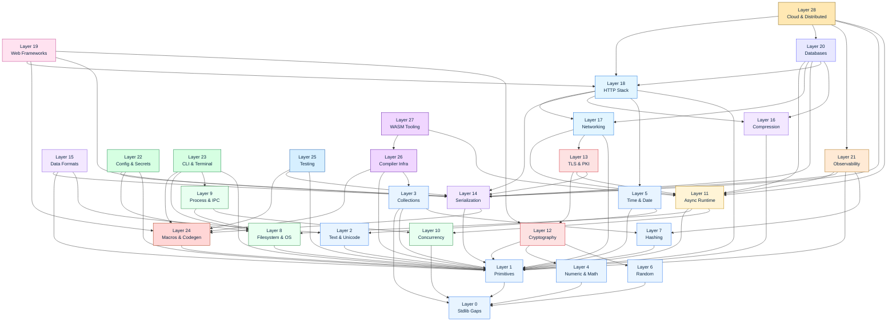

# Bedrock Dependency Graph

Inter-layer dependencies. Edges point **from a layer to its prerequisites** (i.e. `A → B` means *A depends on B*).

A static SVG render of the same graph lives at [`dependencies.svg`](dependencies.svg); regenerate with:

```
dot -Tsvg dependencies.dot -o dependencies.svg
```

---

## Mermaid (renders inline on GitHub)



---

## Edge Inventory

Each row: a layer and the prerequisites it builds upon.

| Layer | Depends on |
|---|---|
| Layer 0 | — |
| Layer 1 | L0 |
| Layer 2 | L1 |
| Layer 3 | L0, L1, L7 |
| Layer 4 | L0 |
| Layer 5 | L1, L2 |
| Layer 6 | L0 |
| Layer 7 | L1 |
| Layer 8 | L1 |
| Layer 9 | L8, L10 |
| Layer 10 | L0 |
| Layer 11 | L1, L8, L10 |
| Layer 12 | L1, L4, L6 |
| Layer 13 | L11, L12, L14 |
| Layer 14 | L1, L24 |
| Layer 15 | L1, L2, L14 |
| Layer 16 | L1 |
| Layer 17 | L1, L11, L13 |
| Layer 18 | L1, L5, L14, L16, L17 |
| Layer 19 | L12, L14, L18, L24 |
| Layer 20 | L11, L14, L16, L17, L18 |
| Layer 21 | L1, L7, L11, L14 |
| Layer 22 | L1, L8, L14 |
| Layer 23 | L1, L8, L9, L24 |
| Layer 24 | L1 |
| Layer 25 | L1, L14, L24 |
| Layer 26 | L1, L3, L24 |
| Layer 27 | L11, L26 |
| Layer 28 | L11, L14, L18, L20, L21 |

---

## Critical Path

The longest dependency chain in the graph (each link blocks the next):

`L0 → L1 → L8 → L11 → L13 → L17 → L18 → L20 → L28`

Translation: stdlib gaps → primitives → filesystem/OS → async reactor → TLS → networking protocols → HTTP → databases → cloud. **Layer 11 (Async Runtime) is the single biggest gating item** — every networking protocol and every database client downstream is blocked on it.

Other notable chains:

- `L0 → L1 → L24 → L14 → L19` — primitives → macros → serialization → web frameworks
- `L0 → L1 → L24 → L26 → L27` — primitives → macros → compiler infra → WASM
